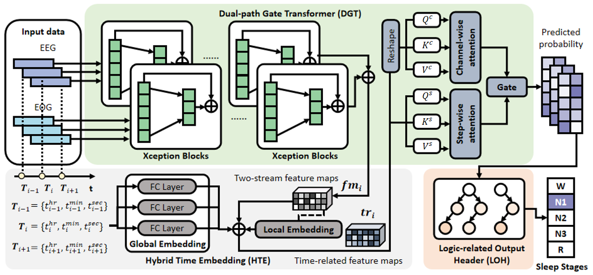

# LMHT
Logic-guided multimodal hybrid embedding transformer for sleep staging

LMHT is a framework for automating sleep stage scoring, comprising a dual-path gate transformer (DGT) module to extract wave characteristics and encode attention patterns, a hybrid time-embedding (HTE) module to combine local and global temporal patterns, and a logic-related output header (LOH) to reconstruct temporal and logical information in accordance with the scoring standard. Compared to other sleep staging solutions, we use local and global time embedding to achieve higher  performance.

## Graphic Abstract


# Overview
The repository contains general functionality for running the LMHT model and its accompanying Baseline architectures on all benchmarked datasets. The Baselines include state-of-the-art architectures like SalientSleepNet, UTime, InceptionTime, Xception, and others.

The models can be benchmarked on the publicly available SleepEDF-SC and SleepEDF-ST datasets for sleep stage segmentation available here: [sleep-edf](https://www.physionet.org/content/sleep-edfx/1.0.0/).

## Installation (Environment)

There are many dependencies for our code and we propose to use Anaconda as package manager.
### Requirements

We recommend to use [Anaconda](https://www.anaconda.com/) to create a new python environment:

```bash
conda create -n lmht python=3.11.4 
```

To install PyTorch, run:

```bash
conda install pytorch torchvision torchaudio cudatoolkit=11.1 -c pytorch 
```

For other installation types and cuda versions, visit [pytorch.org](https://pytorch.org/get-started/locally/).

To install requirement packages, run:
```bash
conda install scikit-learn matplotlib
pip install torchnet h5py prefetch_generator
```

## LMHT configuration
Everything related to LMHT can be found in the LMHT directory. 
#### Hyperparameter configuration 
Hyperparameters for DETRtime are read via the command line. We provide a run and evaluation shell script to save the current run configuration. For a detailed list of possible hyperparameter adaptions check the argument parser in train_speed.py
#### How to run the LMHT model 
To run LMHT, first, execute 
```
python train_speed.py --args
```
to obtain the saved LMHT model without the LOH module is in path model_result/lmhtCP_epochN.pth. 

Second, run
 ```
python --valdir './sleepEDF-SC/train/' model_eval.py
python --valdir './sleepEDF-SC/test/' model_eval.py
```
to get the output possibilities and target sleep stage with patient ID for both the training set and testing set (NAME_tgt_out_LMHTtrain.csv and NAME_tgt_out_LMHTtest.csv).

Third, run 
 ```
python metric_individual.py
```
to obtain the metrics at the epoch level.

Fourth, run
 ```
python generte_dataset_for_LOH.py
```
to get training and testing datasets for the LOH module.

Finally, execute 
```
python LOH.py
```
to train and test the LOH module, also the individual metrics are calculated.

#### How to run the baseline models 

To start the baseline benchmark, run

```bash
python3 --model-list ['deepsleepnet'] main.py
```
the model list can support BiLSTM ('bilstm'), EEG-Net ('eegnet') [1], DeepSleepNet ('deepsleepnet') [2], TinySleepNet ('tinysleepnet') [3], ResConv ('resconv'), InceptionTime ('inceptiontime') [4], Xception ('xception'), ConvLSTM ('convlstm'), UTime ('utime') [5], SalientSleepNet ('salientsleepnet') [6], and SeqSleepNet ('seqsleepnet') [7]. 

## 参考

- [1] [EEGNet: A Compact Convolutional Network for EEG-based Brain-Computer Interfaces](http://arxiv.org/abs/1611.08024)
- [2] [DeepSleepNet: A Model for Automatic Sleep Stage Scoring Based on Raw Single-Channel EEG](https://ieeexplore.ieee.org/document/7961240)
- [3] [TinySleepNet: An Efficient Deep Learning Model for Sleep Stage Scoring based on Raw Single-Channel EEG](https://doi.org/10.1109/EMBC44109.2020.9176741)
- [4] [InceptionTime: Finding AlexNet for time series classification](https://doi.org/10.1007/s10618-020-00710-y)
- [5] [U-Time: A Fully Convolutional Network for Time Series Segmentation Applied to Sleep Staging](https://proceedings.neurips.cc/paper/2019/hash/57bafb2c2dfeefba931bb03a835b1fa9-Abstract.html)
- [6] [SalientSleepNet: Multimodal Salient Wave Detection Network for Sleep Staging](https://doi.org/10.24963/ijcai.2021/360)
- [7] [SeqSleepNet: End-to-End Hierarchical Recurrent Neural Network for Sequence-to-Sequence Automatic Sleep Staging](https://ieeexplore.ieee.org/document/8631195)
